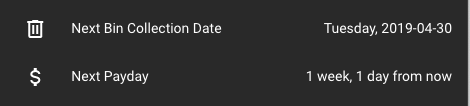

# Periodic Event tracker for Home Assistant

This is a simple _sensor_ for keeping track of the state of a weekly periodic
event, occurring on the same day of the week.  At present, it is reasonably
opionated being one-day-a-week but supports different weekly periods (weekly,
fortnightly, monthly, bimonthly and so on).  The display of the event is
available in several formats.



## Installation

Copy or symlink the `periodic_event/` folder to
`custom_components/periodic_event` within your configuration directory,
creating the `custom_components/` directory if it doesn't already exist.

Add a sensor into your `configuration.yaml` file like so:

```yaml
  - platform: periodic_event
    name: Next Payday
    icon: mdi:currency-usd
    epoch: 2019-02-05
    frequency: 2
```

With this example, you'll now have sensors `sensor.next_payday` and
`sensor.next_payday_date` available for use within your dashboard.  Your
sensors will be named differently depending on the `name:` you choose.

## Configuration

* `name`: the textual name for your event sensor, used to determine its entity
  ID.  For the exact entity ID, refer to your Home Assistant "unused entities"
  screen.
* `icon`: the icon to display for this entity, in standard Home Assistant
  notation
* `epoch`: any given date that your event occurred in the past. Its weekday (eg
  Monday through Sunday) is used to determine the day of the week a future event
  will be on.
* `frequency`: number of weeks between events. Use `1` for weekly, `2` for
  fortnightly and so on.

## Contributing

PRs are welcome but open an issue first to discuss anything major.

## Licence

MIT; see `LICENSE.txt`.
